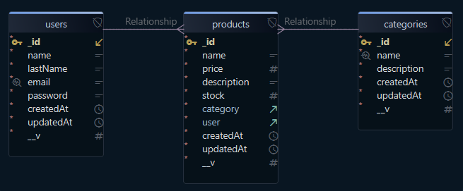

# 🛒 Sistema de Gestión - Backend

API REST desarrollada con **Node.js**, **Express** y **MongoDB** para gestionar usuarios, categorías y productos. Pensada como backend de un sistema de inventario para comercios, incluye:  

- 🔐 **Autenticación segura** con JWT y contraseñas encriptadas con bcrypt.  
- 👥 **Gestión de roles** (admin / cliente) y rutas protegidas para la administración del stock.  
- 📦 **Endpoints para usuarios, categorías y productos**, con soporte para **paginación, ordenamiento y filtrado**.  
- 🔎 **Búsqueda de productos por nombre**, combinable con filtros y ordenamiento.  
- 🩺 **Health Check** y 📊 **métricas internas** para monitoreo y debugging.  
- 🛡 **Seguridad adicional** mediante rate limiting y protección contra abusos y ataques de fuerza bruta.  
- 🚀 Preparado para **desarrollo y producción**, con scripts de ejecución y **mocks** para probar la API.

---

## 📁 Estructura del proyecto (resumen)
```
Sistema_de_gestion-Backend/
├── node_modules/                      # Dependencias instaladas por npm
├── src/
│   ├── assets/                        # Recursos estáticos
│   │   └── images/         
│   │
│   ├── config/                        # Configuración general (base de datos, variables, etc.)
│   │   ├── config.js            
│   │   └── db.js                 
│   │
│   ├── models/                        # Definición de los esquemas de datos (Mongoose)
│   │   ├── productModel.js            # Modelo de Producto
│   │   ├── categoryModel.js           # Modelo de Categoría
│   │   └── userModel.js               # Modelo de Usuario
│   │
│   ├── services/                      # Capa de lógica y conexión con la base de datos
│   │   ├── productService.js          # Lógica del CRUD de productos
│   │   ├── categoryService.js         # Lógica del CRUD de categorías
│   │   └── userService.js             # Lógica de usuarios (registro, login, etc.)
│   │
│   ├── controllers/                   # Controladores que gestionan las solicitudes HTTP
│   │   ├── productController.js       # Controlador de productos
│   │   ├── categoryController.js      # Controlador de categorías
│   │   ├── userController.js          # Controlador de usuarios
│   │   ├── metricsController.js       # Controlador de métricas del sistema
│   │   └── healthController.js        # Controlador de Health check (salud de la DB)
│   │
│   ├── routes/                        # Definición de las rutas de la API
│   │   ├── productRoute.js            # Rutas de productos (/products)
│   │   ├── categoryRoute.js           # Rutas de categorías (/categories)
│   │   ├── userRoute.js               # Rutas de usuarios (/users)
│   │   ├── metricsRoute.js            # Rutas de métricas del sistema (/metrics)
│   │   └── healthRoute.js             # Rutas de Health check (salud de la DB)
│   │
│   ├── middleware/                    # Middlewares personalizados
│   │   ├── verifyTokenMiddleware.js   # Middleware de autenticación JWT
│   │   ├── authorizeOwnerOrRoles.js   # Gestiona rol de admin o dueño
│   │   ├── authorizeRoles.js          # Gestiona rol de admin
│   │   ├── errorHandler.js            # Gestiona errores
│   │   ├── metrics.js                 # Middleware de las metricas del sistema
│   │   └── apiLimiter.js              # Controla las peticiones a la api y en el login
│   │
│   └── utils/
│       ├── apiError.js                # Clase para lanzar errores personalizados con status HTTP
│       ├── buildProductSort.js        # Utilidad para construir ordenamientos dinámicos (sorting)
│       ├── extractProductFilters.js   # Extrae y normaliza filtros desde req.query
│       ├── buildProductFilters.js     # Convierte filtros genéricos en queries MongoDB
│       └── catchAsync.js              # Wrapper para evitar repetir try/catch en controladores
│   
├── .env                               # Variables de entorno (URI MongoDB, JWT_SECRET, etc.)
├── .env.example                       # Ejemplo de configuración del entorno
├── .gitignore                         # Archivos y carpetas ignorados por Git
├── app.js                             # Punto de entrada principal del servidor Express
├── package.json                       # Dependencias, scripts y metadatos del proyecto
├── package-lock.json                  # Versiones exactas de las dependencias instaladas
└── README.md                          # Documentación general del proyecto

```

---

## 🗂 Esquema de la DB (colecciones)



---

## 🛠 Tecnologías utilizadas

**Backend:**  
- Node.js (ES Modules)  
- Express  
- MongoDB + Mongoose
- Multer *(instalado – pendiente de implementación para manejo de archivos)*

**Autenticación y seguridad:**  
- JSON Web Tokens (JWT)  
- bcrypt  
- Cors  
- express-rate-limit  
- helmet  

**Optimización y logging:**  
- compression  
- morgan  

**Herramientas de desarrollo:**  
- nodemon  
- npm-check-updates

---

## 🔐 Variables de entorno (ejemplo .env)

Crea un archivo `.env` en la raíz del proyecto con las siguientes variables:

```env
MONGODB_URI=mongodb://localhost:27017    # URL de conexión a MongoDB
DB_NAME=tu_basedatos                     # Nombre de la base de datos
SECRET=tu_secreto_jwt                    # Clave secreta para JWT
PORT=3000                                # Puerto en el que se ejecuta el servidor
```

⚠️ Asegurarse que `src/config/config.js` lea estas variables.

---

## 🔒 Seguridad adicional: Rate Limiting

Para proteger la API contra ataques de fuerza bruta y uso excesivo, se incorporo un **limitador de peticiones** usando `express-rate-limit`.  
- Límites configurables (por defecto, X peticiones por Y minutos — ver en `src/middleware/apiLimiter.js`)  
- Aplica a todas las rutas sensibles (autenticación, login, CRUDs)  
- Ayuda a prevenir abusos, DoS ligeros y proteger recursos del servidor  

Al usar la API, en cada request se monitorea la cantidad de peticiones; si se supera el umbral, la respuesta será un **429 Too Many Requests**.

---

## ⚙️ Instalación y ejecución (Windows)

1. 🧩 **Requisitos previos**

Asegúrate de tener instalado:

- **Node.js** (versión 18 o superior)
- **npm**
- **MongoDB**

2. 📁 **Clonar el repositorio**

``` bash
git clone https://github.com/GaitanTomas/Sistema_de_gestion-Backend

```

3. **Entrar al directorio**

``` bash
cd Sistema_de_gestion-Backend

```

4. 📦 **Instalar dependencias**

``` bash
npm install
```

*Dependencias principales:*
- express
- mongoose
- bcrypt
- jsonwebtoken
- cors
- dotenv
- express-rate-limit
- helmet
- compression
- morgan

*Dependencias de desarrollo:*
- nodemon
- npm-check-updates

5. 🚀 **Ejecutar el proyecto**

*Scripts disponibles:*

| Modo | Comando |
|------|---------|
| Desarrollo | `npm run dev` |
| Producción | `npm start` |

## 📡 Endpoints disponibles

> 🔒 Usar header en rutas protegidas: Authorization: Bearer <JWT_TOKEN_AQUI>

**Rutas de Usuarios 👤**
- POST /api/users/register — Registro (pública)
- POST /api/users/login — Login (pública) → devuelve JWT
- POST /api/users/createAdmin — Crear admin (protegida)
- GET /api/users/getUsers — Obtener todos (protegida)
- GET /api/users/getUserById/:id — Obtener por ID (protegida)
- PUT /api/users/updateUser/:id — Actualizar (protegida)
- DELETE /api/users/deleteUser/:id — Eliminar (protegida)

**Rutas de Categorías 🏷️**
- POST /api/category/create — Crear (protegida)
- GET /api/category/getCategory — Obtener todas (pública)
- GET /api/category/getCategoryById/:id — Obtener por ID (pública)
- PUT /api/category/updateCategory/:id — Actualizar (protegida)
- DELETE /api/category/deleteCategory/:id — Eliminar (protegida)

**Rutas de Productos 📦**
- POST /api/products/create — Crear (protegida)
- GET /api/products/getProducts — Obtener productos (pública)

> Soporta **paginación, ordenamiento y filtros**

  ```bash
  /api/products/getProducts?page=<número>&limit=<número>&sort=<criterio>&category=<id_categoria>&minPrice=<número>&maxPrice=<número>&inStock=<true|false>
  ```
- GET /api/products/getProductById/:id — Obtener por ID (pública)
- GET /api/products/search?name=<texto> — Buscar productos por nombre (pública)

> Soporta **búsqueda por nombre (requerido), paginación, ordenamiento y filtros**

  ```bash
  /api/products/search?name=<texto>&page=<número>&limit=<número>&sort=<criterio>&category=<id_categoria>&minPrice=<número>&maxPrice=<número>&inStock=<true|false>
  ```
- PUT /api/products/updateProduct/:id — Actualizar (protegida)
- DELETE /api/products/deleteProduct/:id — Eliminar (protegida)

### 🔎 Paginación, ordenamiento y filtrado de productos

> 💡 Todos estos parámetros se pueden combinar libremente.

1️⃣ **Paginación**

Los endpoints de productos soportan **paginación** mediante los siguientes query params:

| Parámetro | Descripción |
|----------|------------|
| `page` | Número de página (opcional, por defecto 1) |
| `limit` | Cantidad de resultados por página (opcional, por defecto 10, máximo 50) |

2️⃣ **Ordenamiento de productos**

El ordenamiento se realiza mediante el query param `sort`.

**Valores disponibles:**

| Valor | Descripción |
|------|------------|
| `newest` | Más nuevos primero |
| `oldest` | Más antiguos primero |
| `price_asc` | Precio menor a mayor |
| `price_desc` | Precio mayor a menor |
| `name_asc` | Nombre A → Z |
| `name_desc` | Nombre Z → A |

3️⃣ **Filtrado de productos**

El filtrado se realiza mediante los siguientes query params:

| Parámetro | Descripción |
|---------|------------|
| `category` | ID de la categoría |
| `minPrice` | Precio mínimo |
| `maxPrice` | Precio máximo |
| `inStock` | `true` → con stock / `false` → sin stock |

**Rutas de Health Check 🩺**
- GET /api/health — Health Check del servidor y estado de la base de datos (pública)

> Usada por servicios externos (load balancers, uptime monitors).

**Rutas de Metrics 📊**
- GET /api/metrics — Métricas internas del sistema (protegida)

> ⚠️ Endpoint interno, protegido. Para monitoreo y debugging.

---

## 🧪 Mocks / Ejemplos de requests (JSON)

MOCKS DE USUARIOS

1) Registro — POST /api/users/register
```json
{
  "name": "user",
  "lastName": "nuevo",
  "email": "user@mail.com",
  "password": "Abc1234"
}
```

2) Login — POST /api/users/login
```json
{
  "email": "user@mail.com",
  "password": "Abc1234"
}
```
(Copiar el token devuelto y usar en Authorization: Bearer <TOKEN>)

3) Crear admin — POST /api/users/createAdmin
```json
{
  "name": "admin",
  "lastName": "nuevo",
  "email": "adminnuevo@mail.com",
  "password": "Abc1234"
}
```
- Esto solo se puede hacer si estas logueado con un token de administrador.
- Para esto, el admin principal se debe crear desde **MongoDB Compass** manualmente.
- (Copiar el token devuelto al loguearte como admin y usar en Authorization: Bearer <TOKEN>)

4) Obtener todos (protegida) — GET /api/users/getUsers  
Header: Authorization: Bearer <JWT_TOKEN_AQUI>

5) Obtener por ID (protegida) — GET /api/users/getUsersById/<ID_DEL_USUARIO>  
Header: Authorization: Bearer <JWT_TOKEN_AQUI>

6) Actualizar (protegida) — PUT /api/users/updateUser/<ID_DEL_USUARIO>
```json
{
  "name": "User Actualizado",
  "password": "NewPass123"
}
```

7) Eliminar (protegida) — DELETE /api/users/deleteUser/<ID_DEL_USUARIO>

---

MOCKS DE CATEGORÍAS

1) Crear (protegida) — POST /api/category/create
```json
{
  "name": "Electrónica",
  "description": "Productos electrónicos y gadgets"
}
```

2) Obtener todas (pública) — GET /api/category/getCategory

3) Obtener por ID (pública) — GET /api/category/getCategoryById/<ID_DE_LA_CATEGORÍA>

4) Actualizar (protegida) — PUT /api/category/updateCategory/<ID_DE_LA_CATEGORÍA>
```json
{
  "name": "Electrónica y Tecnología",
  "description": "Todos los dispositivos electrónicos y gadgets"
}
```

5) Eliminar (protegida) — DELETE /api/category/deleteCategory/<ID_DE_LA_CATEGORÍA>

---

MOCKS DE PRODUCTOS

1) Crear (protegida) — POST /api/products/create
```json
{
  "name": "iPhone 15",
  "price": 150000,
  "category": "<ID_DE_LA_CATEGORIA_ELECTRONICA>",
  "description": "Nuevo iPhone con cámara mejorada",
  "stock": 10
}
```

2) Obtener todos (pública) — GET /api/products/getProducts?page=1&limit=10&sort=newest

> Todos los filtros son opcionales y pueden agregarse libremente

3) Obtener por ID (pública) — GET /api/products/getProductById/<ID_DEL_PRODUCTO>

4) Buscar por nombre (pública) — GET /api/products/search?name=iPhone&page=1&limit=10&sort=price_desc

> Todos los filtros son opcionales y pueden agregarse libremente. También podés cambiar iPhone por cualquier palabra parcial para probar la búsqueda.

5) Actualizar (protegida) — PUT /api/products/updateProduct/<ID_DEL_PRODUCTO>
```json
{
  "price": 155000,
  "stock": 8
}
```

6) Eliminar (protegida) — DELETE /api/products/deleteProduct/<ID_DEL_PRODUCTO>

---

## ✅ Consejos y notas de desarrollo

- Todos los **servicios** manejan errores de manera profesional usando la clase `ApiError`.  
Esto significa que cada error devuelve el **status HTTP correcto**, y el middleware `errorHandler` captura y responde con un formato consistente:  
```json
{
  "status": "error",
  "message": "Descripción del error"
}
```
- Si ves errores como "Schema hasn't been registered for model 'X'", verificar que los modelos en `src/models/*.js` exporten correctamente `mongoose.model('X', schema)` y que no haya importaciones circulares.
- Todas las contraseñas de usuarios se guardan encriptadas usando bcrypt para garantizar seguridad.
- El middleware de verificación JWT debe ejecutarse y asignar correctamente `req.user` (contiene el id del usuario) antes de crear productos, ya que el Product schema requiere `user`.
- Para probar usar Thunder Client / Postman: incluir header Authorization en rutas protegidas.

---

## 👨‍💻 Autor

Tomás Gaitán — Proyecto para Diplomatura UTN Fullstack 2025.

---
## 📜 Licencia
Este proyecto se entrega con fines académicos bajo licencia MIT.